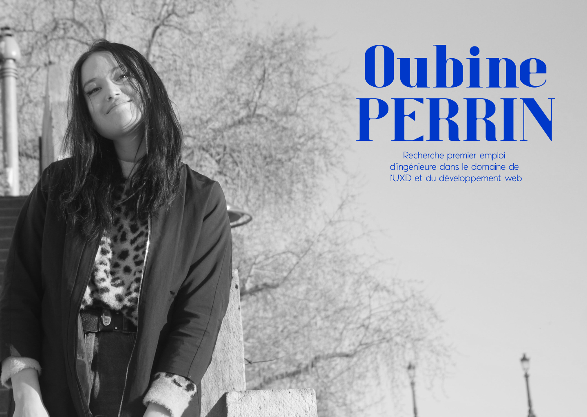
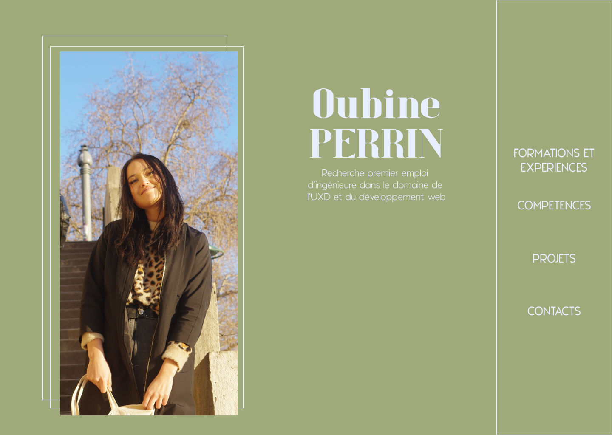

# Conception ergonomique, Design et Développement Web d'un CV interactif sur internet 

Bienvenue sur le repository de mon CV en ligne. Celui-ci a été codé par mes soins dans un le cadre d'un projet de fin d'étude à l'utc au sein de la branche informatique. 

Voici le lien du site: https://oubine-perrincv.netlify.app/

Vous trouverez ci-dessous le rapport détaillant l'élaboration de ce projet. Ce rapport est divisé en 4 parties. Tout d'abord nous allons rappeler dans quel cadre ce projet d'études a commencé, pourquoi celui-ci a vu le jour. Ensuite, je vous présenterai les différentes étapes du design de l'interface et les outils utilisés pour cela.  Enfin nous verrons comment s'est déroulée l'étape de développement, avant de conclure sur les perspectives d'améliorations de l'application.

- [1. Introduction](#introduction)
- [2. Design de l'interface](#design)
	- [a. Outils utilisés](#outils_utilisés)
	- [b. Organisation des informations et choix de la charte graphique](#charte_graphique)
	- [c. Aperçus des deux versions](#deux_versions)
- [3. Développement du site web]("#developpement")
	- [a. Initialisation avec create-react-app]("#react_app")
	- [b. Organisation du src et des composants]("#organisation")
	- [c. Outils et librairies utilisées]("#librairies")
	- [d. Animations]("#animations")
- [4. Mise en ligne sur netlify]("#mise_en_ligne")
- [5. Perspectives d'amélioration]("#perspectives")
	- [a. Animation plus fluides]("#animations")
	- [b. Version française et anglaise]("#version_anglaise")
	- [c. Version mobile]("#version_mobile")

## 1. Introduction

Ce projet de site web intitulé: g'gngnfnfnrn entre dans le cadre d'une TZ. à l'utc, une TZ est l'appellation pour un projet de fin d'étude: les étudiants en fin de cursus a qui il manque des crédits pour valider leur diplôme peuvent réaliser en autonomie un projet encadré par un enseignant pour rattraper leur dernier crédits manquants sans a avoir à faire un semestre supplémentaire. 

C'est la situation dans laquelle je me suis retrouvée en février. J'ai alors décidé de réaliser un projet orienté web car je souhaite m'orienter vers le design d'interface utilisateur pour mon parcours professionnel. Le but du projet était donc de créer un site web faisant d'office de CV utilisable par la suite dans ma vie professionnelle.

J'ai donc assumé toutes les étapes du développement d'un site web. Ce processus se déroule en 3 étapes: le design d'interface, le développement et la mise en ligne. La premiere consiste à conceptualiser le visuel de linterface et l'organisation visuelle des éléments qui la compose, la seconde a coder l'interface en question et enfin la mise en ligne revient à rendre le site disponible a tous sur internet. Les outils utilisés pour chaque étapes sont détaillés dans les parties dédiées dans la suite du rapport. Néanmoins, ces étapes ne sont pas imperméables les unes aux autres. 

En effet, dans la mesure où j'ai été la seule à travailler sur ce projet, ces étapes ne sont pas realisees linéairement les unes après les autres. Par exemple, la conception de certains éléments  du visuel ont été faites en même temps que le développement de l'application. Cela a été possible dans la mesure où j'ai été seule à travailler sur le projet, dans un milieu professionnel, différentes personnes sont en charge des différentes étapes du processus les rendant plus imperméables les unes des autres. Ainsi, pour un soucis de clarté, les différentes étapes du processus sont expliquées linéairement dans la suite du rapport.

## 2. Design de l'interface

Donc, dans un premier temps, il faut procéder au design de l'interface. Cela revient dans un premier temps a réfléchir aux questions suivantes : quelles sont les informations nécessaires dans un CV? Quelles sont leur ordres d'importance et comment on veut les agencer les unes par rapports aux autres ? Quelles sont les fonctionnalités nécessaires pour rendre la lecture de ce CV dynamique et interrative ? Quelles couleurs utiliser? Puis il faut faire une maquette du site, faire des visuels qui montrent a quoi le site devrait ressembler a la fin du projet. Ces aperçus ne sont pas fonctionnels mais a but indicatifs pour donner une direction au travail de développement. 

### a. Outils utilisés

Pour cette étape je me suis tout d'abord basée sur un CV que j'avais fait au paravent pour avoir les informations que je souhaitait mettre dans ce CV en ligne. 
J'ai utilisé figma, un logiciel est un éditeur de graphiques vectoriels et un outil de prototypage, dédié pour l'élaboration des maquettes d'interfaces graphiques. 

### b. Organisation des informations et choix de la charte graphique

Grâce au CV que j'avais déjà fait j'avais les différentes section pour mon CV en ligne : formation, compétences, projets et contacts/autres informations (ex loisirs). Dans la mesure où c'est un site qui est donc interactif, il a été possible de regrouper certaines informations sous une même section (ex: contacts et informations supplémentaires). De plus, comme le but n'étais pas de faire une simple retranscription de CV en ligne, j'ai ajouté une page d'accueil, un menu pour circuler dans le site et des interactions pour le rendre plus ludique d'utilisation.

Pour la charte graphique, le choix des couleurs et des polices, je voulais un design ergonomique et moderne. C'est pourquoi j'ai choisi une couleur principale très présente accompagnée de photos. De plus, comme de nombreux sites aujourd'hui, j'ai fait le choix d'une partie static avec les informations principales et le menu de circulation et une partie qui se lit en scrollang de haut en bas sur la page. Comme le site n'est pas complexe, j'ai décidé de mettre cette partie sur le côté droit de la page au lieu de en haut comme cela se fait pour les sites plus complexe. 

Le vers le figma: https://www.figma.com/file/UazVrdDff4nfKrQ03PrbiD/TZZzzzz?node-id=0%3A1

### c. Aperçus des deux versions

J'ai fait 2 maquettes, la première m'a posé de nombreux problèmes pour le scrollage car je souhaitais une navigation via un scrollage "contrôlé". J'ai essayé plusieurs manières de le coder mais celui-ci restait peu naturel donc j'ai préféré revoir la manière de circuler dans le site. J'ai profité de ce changement de direction pour revoir la charte graphique et choisir des couleurs plus claires pour que celles ci me représentent mieux.

Première version:

Deuxième version:

## 3. Développement du site web

Après avoir établit un aperçu de l'interface graphique du site web, il a fallut coder celui-ci. Il a été entièrement codé en Javascript, en utilisant la librairie React. La mise en forme a été faite en Css. J'utilisé le gestionnaire de packages Node.js.

### a. Initialisation avec create-react-app

Pour démarer j'ai utilisé la commande: 

> npx create-react-app cv-app 

une commande qui permet de créer un dossier avec tous les scripts pour lancer une app web. Ce site générique comporte une unique page avec une configuration basique. Une fois cette configuartion mise en place, il est ensuite facile de construire pour élaborer une application plus complexe. 

Pour cela, il faut se placer dans le nouveau dossier créer et lancer la commande: 

> npm start

pour lancer le script en local (http://localhost:3000/) et voir ce qui est fait.

Enfin, la commande: 

> npm build 

permet de créer un script static pour la mise en ligne du site.

### b. Organisation du src et des composants

Dans la mesure où l'application que j'ai eu à développer comporte plusieurs éléments et est plus compliquée que l'application de base mise en place par la commande 

> create-react-app

il a fallut réorganiser tout le dossier contenant les scripts du site. Actuellement, l'organisation des scripts se fait de la manière suivante: 

- cv-app: dossier root
	- node_modules : dossier avec tous les packages à télécharger pour lancer les scripts (dans .git ignore)
	- public : dossier contenant tous le script en html sur lequel tout le reste de l'application est construit
		- files: dossier contenant les pdf téléchargeables depuis l'application
	- src : dossier contenant tous les scripts en javascripts
		- components : dossier contennant tous les composants React
		- css : dossier contennant tous les scripts css 
		- fonts : dossier contennant tous les fichiers *.ttf* (polices utilisées)
		- images : dossier contennant toutes les images 
		- index.js : scripts qui appelle le index.html

### c. Outils et librairies utilisées 

## 4. Mise en ligne sur netlify

## 5. Perspectives d'amélioration
### a. Animation plus fluides
### b. Version française et anglaise
### c. Version mobile
